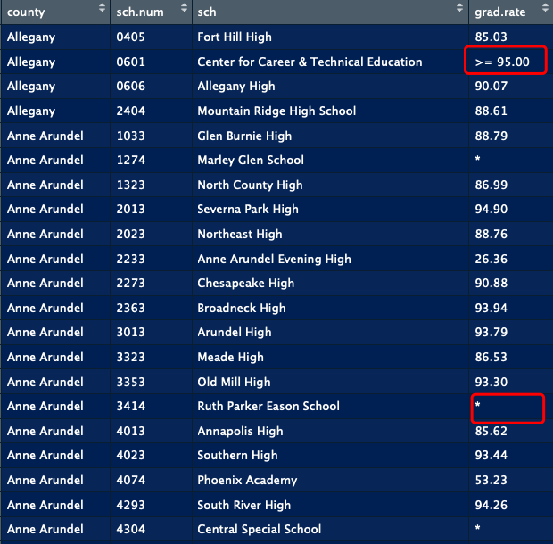
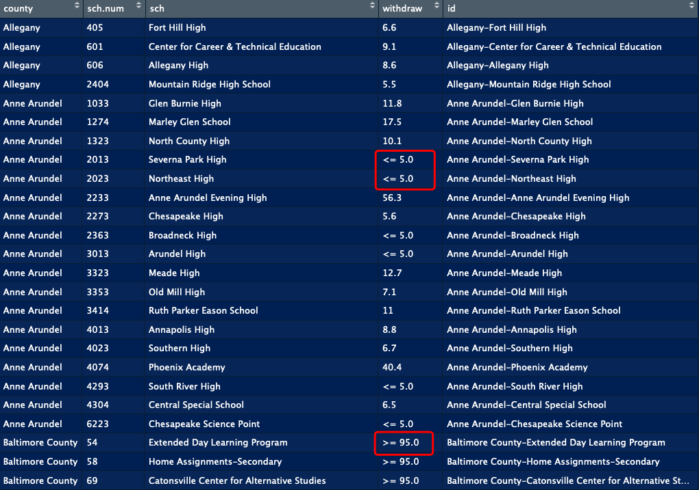

```{r setup, include=FALSE}
knitr::opts_chunk$set(echo = TRUE, message = FALSE,
                      warning = FALSE)
```

```{r,warning = F}
library(kableExtra)
library(tidyverse)
library(dplyr)
```


# Motivation


<div align="center">
<iframe width="560" height="315" src="https://www.youtube.com/embed/g5ylQgdisTM" frameborder="0" allow="accelerometer; autoplay; encrypted-media; gyroscope; picture-in-picture" allowfullscreen>
</iframe>
</div>

<center>
[source: https://www.youtube.com/watch?time_continue=8&v=g5ylQgdisTM]
</center>


# What is the data?


The data files were downloaded from [the Maryland Report Card website](http://reportcard.msde.maryland.gov/Graphs/#/Introduction/Intro/uction/17/uction/17/3). It aims to share the most current information available to help stakeholders understand and measure student achievement in all 24 local school systems. You can find [`Data Download`](http://reportcard.msde.maryland.gov/Graphs/#/DataDownloads/datadownload/3/17/6/99/XXXX) on the bottom part of the web page, which provides public data for download. 

While all this knowledge can be empowering, too much information can be overwhelming. Important details may be lost in a flood of data, and a large amount of information can make it difficult to make decisions. These files are large because they contain information for 1600+ schools in Maryland, based on school level and county level, ranging from 2003 to 2018. Admittedly, county level data are less and tidier, so it is easier to deal with. But we believe it is school level data's 'untidiness' that guarantees a detailed and diverse anaysis. So we decide to focus on 5 files of year 2017, and mainly make use of school level data. 


# Data Import

We saved all files in a folder called 'data2017', when you need to deal with multiple files in a folder, setting environment is necessary since it enables you to find what you want more quickly and accurately.

```{r include=FALSE}
setwd('./data2017')

files = list.files(pattern="*.csv")

data <- lapply(files, function(x){
  read.csv(x, header=T)})

```

'data' is a large list containing 5 files:

  * data[[1]]: Cohort_Grad_Rate_2017.csv
  * data[[2]]: PARCC_2017.csv
  * data[[3]]: Special_Services_2017.csv
  * data[[4]]: Student_Mobility_2017.csv
  * data[[5]]:Wealth_Expenditures_Data_2017.csv

# Data Wrangling

> Tidy datasets are all alike, but every messy dataset is messy in its own way. ?????? Hadley Wickham

This section includes large amount of data wrangling such as gather, merge, mutate etc. Each step requires a specific tool to complete, and we would like to show the data set again and again everytime we apply a specific tool. RStudio prodives a data viewer that enables you to look inside data frames and other rectangular data structures. You can invoke the viewer in a console by calling the `View()` function on the data frame you want to look at.

## Graduation Rate

Have a qucik look of graduation rate file:

```{r}
#View(data[[1]])
```


### selection, rename 

```{r}
df_grad <- data[[1]] %>%
 filter( School.Number != 'A', 
        Cohort == '4-year adjusted cohort') %>%
 select(LEA.Name, School.Number,
         School.Name, Grad.Rate)

colnames(df_grad) <- c('county', 'sch.num',
                       'sch', 'grad.rate')
head(df_grad)
```

### unique id
As we mentioned, we need to extract information from several files and merge them together, requiring a key that specifies each school uniquely. Choice can be `sch.num` or `sch.name`, let's look at the summary:

```{r}
summary(df_grad[,2:3])
```
We notice, whether `sch.num` or `sch.name` is not unique since the frequency of some values is larger than 1. Therefore it is definitely important to define an id. 

```{r}
df_grad <- df_grad %>%
    within( id <- paste(county, sch, sep = '-'))


temp <- as.data.frame(table(df_grad$id))
temp[temp$Freq > 1,]
```

Now, we get a unique key element - id.

### missing value

There are a lot of missing values in the dataset, which would influence further analysis if we leave them there. As we shown before, missing values exist in different forms - '*', '>= 95.00','<= 5.00'.  

```{r}
summary(df_grad[2:4]) 
```

The first type of missing value ('*') is confusing, let's extract them out and have a look:

```{r}
head(df_grad[df_grad$grad.rate == '*', ])
```

If we search [Marley Glen School](https://www.aacps.org/domain/1364), we may found it mainly provides program for students with disabilities. Also, [Ruth Parker Eason School](https://www.aacps.org/Page/3684) provides a special education program for students with moderate to severe disabilities. So we guess schools with '*' graduation rate mainly provide education for students with moderate to severe disabilities, and will not be considered in our analysis.  

```{r}
df_grad <- df_grad[df_grad$grad.rate != '*', ]
summary(df_grad[2:4]) 
```

Now we need to pay attention to the other two kinds of missing value. We are not able to calculate the exact graduate rate because of the lack of information so we decide to use `gsub()` function to replace incomplete values. `gsub()` function replaces all matches of a string. Elements of string vectors which are not substituted will be returned unchanged.

We would use 2.5 to replace '<= 5.00' and 97.5 to replace '>= 95.00' and transfer them to numeric data.

```{r}
df_grad$grad.rate<- gsub('<= 5.00','2.5', df_grad$grad.rate)
df_grad$grad.rate <- gsub('>= 95.00','97.5', df_grad$grad.rate)
df_grad$grad.rate <- as.numeric(df_grad$grad.rate)
summary(df_grad[2:4]) 
```

Now, `df_grad` is a tidy dataset that we want.




## PARCC

[Partnership for Assessment of Readiness for College and Careers (PARCC)](https://parcc.pearson.com) 


### selection, rename 

```{r}
df_parcc <- data[[2]] %>%
  filter( School.Number != 'A' ) %>%
  select(3,4,5,6,9,11,13,15,17)

colnames(df_parcc) <- c('county','sch.num', 
                        'sch', 'subject','L1',
                        'L2','L3','L4','L5')
summary(df_parcc)
```


### filter high school information

```{r}
df_parcc <- df_parcc %>%
  within( id <- paste(county, sch, sep = '-')) %>%
  subset(id %in% df_grad$id) 

```


### missing value

```{r}
df_parcc[,5:9] <- 
  lapply(df_parcc[,5:9], function(x) as.numeric(as.character(x)))

sapply(df_parcc[,5:9], class)
```

contain 1 missing value

```{r}
df_parcc$pro <- NA
indx1 <- !is.na(df_parcc$L1) &  !is.na(df_parcc$L2) & !is.na(df_parcc$L3)
#indx1 <- !is.na(df_parcc[, 5:7])
df_parcc[indx1, 'pro'] <-  100-(df_parcc[indx1,5]+df_parcc[indx1,6]+df_parcc[indx1,7])

sum(is.na(df_parcc$pro))

indx2 <- !is.na(df_parcc$L4) &  !is.na(df_parcc$L5)
df_parcc[indx2, 'pro'] <- df_parcc[indx2,8]+df_parcc[indx2,9]

sum(is.na(df_parcc$pro))

```


### extract assessment information

The proportion of high performance in these assessment ($p$) plays an role of response variable in our later analysis. Thus, splicting them out first makes further analysis convenient.

$$ p_{ela} = \beta_0+\beta_{1} x_1+ \beta_{2} x_2 $$

we choose grade 10 since we believe grade 10 is the most representative.

```{r}
pac <- df_parcc %>%
  select(1,2,3,4,10,11)

df_ela <- pac[grep("English/Language Arts Grade 10", pac$subject), ]
df_alg1 <- pac[grep("Algebra 1", pac$subject), ]
df_alg2 <- pac[grep("Algebra 2", pac$subject), ]
#df_geo <- df_parcc[grep("Geometry", df_parcc$Assessment), ]
```

```{r}
temp <- is.na(df_ela$pro)

#df_ela[temp, ]
```

## Special Services

```{r}
df_spc <- data[[3]] %>%
  filter( School.Number != 'A', School.Type == 'High' ) %>%
  within( id <- paste(LEA.Name, School.Name, sep = '-')) %>%
  subset(id %in% pac$id) %>%
  select(3,4,5,9,21) 

colnames(df_spc) <- c('county', 'sch.num', 'sch', 'farms', 'id')

summary(df_spc)
```


### missing value

```{r}
df_spc[df_spc$farms == '*',]
```

```{r}
df_spc$farms <- gsub('<= 5.0','2.5', df_spc$farms)
```

## Student Mobility

```{r}
df_mob <- data[[4]] %>%
  filter( School.Number != 'A', School.Type == 'High' )%>%
  within( id <- paste(LEA.Name, School.Name, sep = '-')) %>%
  subset(id %in% pac$id) %>%
  select(3,4,5,11,15)

colnames(df_mob) <- c('county', 'sch.num', 'sch', 'withdraw', 'id')


summary(df_mob)

```




```{r}
df_mob$withdraw <- gsub('<= 5.00','2.5', df_mob$withdraw)
df_mob$withdraw <- gsub('>= 95.00','97.5', df_mob$withdraw)
df_mob$withdraw <- as.numeric(df_mob$withdraw)

summary(df_mob)
```

## Wealth Expenditures

```{r}
df_exp <- data[[5]]
```


## Final dataset

### example

```{r}
L_ela <- list(df_ela[, c('id', 'county', 'pro')], df_grad[, c('grad.rate', 'id')], 
              df_mob[, c('withdraw', 'id')], df_spc[, c('farms', 'id')])

temp1 <- Reduce(function(x, y) merge(x, y, by = 'id'), L_ela)

```


### apply function

```{r}
func_merge <- function(data){
  L <- list(data[, c('id', 'county', 'pro')], df_grad[, c('grad.rate', 'id')], 
              df_mob[, c('withdraw', 'id')], df_spc[, c('farms', 'id')])
  final_data <- Reduce(function(x, y) merge(x, y, by = 'id'), L)
  return(final_data)
}


df_ELA <- func_merge(df_ela)
df_ALG1 <- func_merge(df_alg1)
df_ALG2 <- func_merge(df_alg2)

```