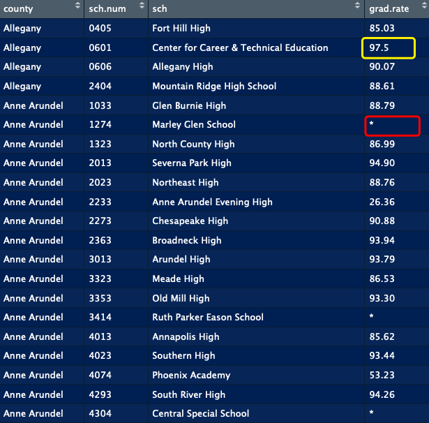
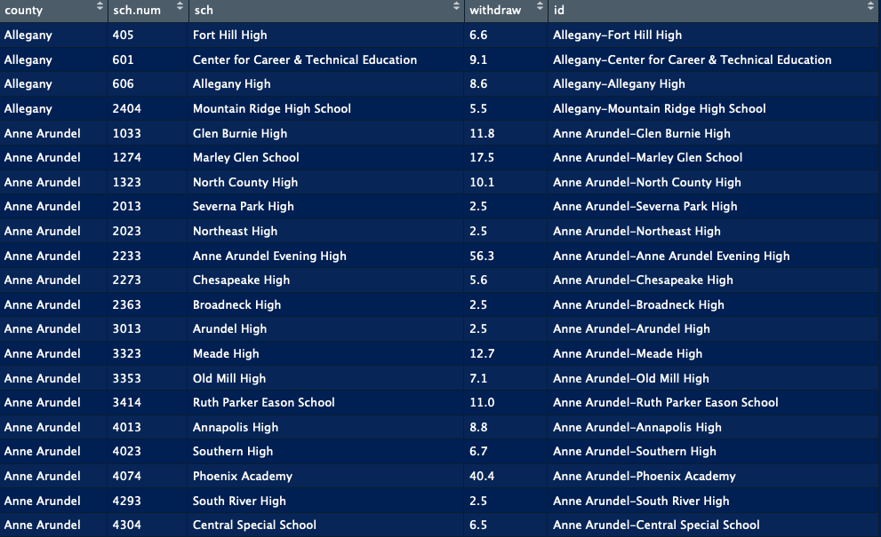

```{r setup, include=FALSE}
knitr::opts_chunk$set(echo = TRUE, message = FALSE,
                      warning = FALSE)
```

```{r,warning = F}
library(kableExtra)
library(tidyverse)
library(dplyr)
library(ggpubr)
library(lattice)
library(lme4)
```


# Motivation

[**LRJ**: Once we finalize the case study, we should come back and revisit the intro/motivation section]

There are over 1400 public schools in Maryland and there are also outstanding students in each school. The federal Every Student Succeeds Act (ESSA) prompted states to develop long term plans to improve schools through accountability and innovation, which sets Maryland's schools on the path to continuous improvement. [Maryland Report Card website](http://reportcard.msde.maryland.gov/) aims to share the most current information available to help stakeholders understand and measure student achievement in all 24 local school systems. Here is a message from the State Superintendent of Schools that enables you to know more about how it functions.


<div align="center">
<iframe width="560" height="315" src="https://www.youtube.com/embed/g5ylQgdisTM" frameborder="0" allow="accelerometer; autoplay; encrypted-media; gyroscope; picture-in-picture" allowfullscreen>
</iframe>
</div>

<center>
[source: https://www.youtube.com/watch?time_continue=8&v=g5ylQgdisTM]
</center>

Our analysis is inspired by this plan - figure out how well schools were performing and how different factors influenced their performance. Once we indentify schools that need improvements and influential factors, both Maryland's government and local organizations can prompt actions and provide necessary support, in a way that is understanable and reliable.

The libraries used in this study are listed in the following table, 
along with their purpose in this particular case study:

|Library|Purpose|
|---|-------------------------------------------------------------------------------------------|
|`kableExtra`|Helps with building common complex tables and manipulating table styles; creates nice-looking HTML tables|
|`tidyverse`|A coherent system of packages for data manipulation, exploration and visualization |
|`dplyr`| Helps you solve the most common data manipulation challenges|


In order to run this code please ensure you have these packages installed. 

The learning objectives for this case study include:

  * data cleaning and wrangling
  * nested data structure

# What is the data?


The data files were downloaded from [the Maryland Report Card website](http://reportcard.msde.maryland.gov/).  Data files can be found by clicking [`Data Download`](http://reportcard.msde.maryland.gov/Graphs/#/DataDownloads/datadownload/3/17/6/99/XXXX) at the bottom of the web page.

At this link, you can find data for all 1400+ schools in Maryland from 2003 to 2018.  For this case study, we will focus on data on high schools from 2017.  For this analysis, we will extract data from 5 of the files for that year:

 * `Cohort_Grad_Rate_2016.csv`: graduation rates for each school in 2016    
 * `PARCC_2017.csv`: school performance on the [Partnership for Assessment of Readiness for College and Careers (PARCC)](https://parcc-assessment.org/) learning assessments                 
 * `Special_Services_2017.csv`: school participation in the Free and Reduced Meals (FARMs) program and school participation in Special Education programs        
 * `Student_Mobility_2017.csv`: percentage of students that either enter or withdraw from the school       
 * `Wealth_Expenditures_Data_2017.csv`: county level wealth and expenditure data for education

# Data Import

After downloading the 5 data files, we can write a script to import all the files in the same folder into `R` relatively easily.  In this case, we've saved all files in a folder named `Data`:


Knowing which environment you are in is necessary since it enables `R` to find these files quickly and accurately. Since our data files are in the folder `Data`, we will need to specify this in the path to each file.

Instead of importing each file with an individual line of code, we can use the function `lapply()` to import them all simultaneously.  To do this, first we make a vector of all of the names for the files we want to import.  The `list.files()` function will make a vector of all files in a folder that match a given pattern.  Here we want all `.csv` files, so we can use `pattern="*.csv"` to specify all files that end with a `.csv`.  The `*` character means any set of characters can be in that location in the file name.

```{r}
files = list.files(path='./Data',pattern="*.csv")
files
```

Next we create a vector of paths to these files by pasting the folder name, `Data`, to the path for each file.

```{r}
filePaths = paste0("./Data/", files)
filePaths
```

Finally, we can read in each data file. The `lapply()` function will apply the same function repeatedly to each item in a vector and store the results in a list.  The function we want to apply repeatedly is the `read_csv()` function; by giving the vector of file paths and this function to `lapply()`, we can ready in all 5 data files at once.

```{r}
data <- lapply(filePaths, read_csv)
```


Now we have a `data` object that consists of a list of 5 data sets. 
```{r}
data
```

We can access an individual data set with the `[[ ]]` operator.
```{r}
data[[1]]
```

Looking at the data, we can see that many of the column names have spaces, which means that we will have to put ticks around the names to refer to them, for example: `Class of Year`. We can replace all the spaces in the names with `.` using the `make.names()` function:

```{r}
names(data[[1]])
make.names(names(data[[1]]))
```

We can do this for each of our 5 data sets using a `for` loop:
```{r}
for (i in 1:5) {
  names(data[[i]]) <- make.names(names(data[[i]]))
  data[[i]] <- mutate_if(data[[i]], is.character, as.factor)
}
```


# Data Wrangling

> Tidy datasets are all alike, but every messy dataset is messy in its own way. - Hadley Wickham

[**LRJ**: is the quote from a book?  then we need to cite the book and not just the author]

A large part of the case study involves data wrangling to get these five data files into a single data set that we can analyze.  To do this, we will alternate between viewing the data and performing data wrangling steps.  In this case-study, we will provide screenshots of the data; you can view the data in the same way by using the `View()` function on the data frame we are working with.

## Graduation Rate

The first data file (`Cohort_Grad_Rate_2017.csv`) records the percentage of students in each school who received a Maryland high school diploma during 2017. Let's look at the data frame that comes from this file:

```{r eval = FALSE}
View(data[[1]])
```


```{r}
dim(data[[1]])
```

This data frame has a total of `r nrow(data[[1]])` rows with `r ncol(data[[1]])` variables. Looking at this data frame in `R`, we see there are several issues we will need to address, such as possible missing values designated by `*`.  We will deal with these issues in later steps.

### Selecting and renaming variables

Our first step is to subset to only school-level data. We notice that if `School.Number` equals `A`, then this row corresponds to county-level data: this row gives the graduation rate across all of the high-schools in the county. 

We also notice that there are two rows of data for each school giving two different graduation rates for the school.  These graduation rates are for different cohorts of students:

 * **5-year adjusted cohort** graduation rate: the percentage of a school's cohort of first-time 9th grade students who graduate within five years, adjusted for students who transfer in and out of the cohort after 9th grade.
 * **4-year adjusted cohort** graduation rate: the percentage of a school's cohort of first-time 9th grade students who graduate within four years, adjusted for students who transfer in and out of the cohort after 9th grade.
 * **3-year adjusted cohort** graduation rate: the percentage of a school's cohort of first-time 9th grade students who graduate within three years, adjusted for students who transfer in and out of the cohort after 9th grade.
 
We notice big differences in the values for these graduation rates -- the 3-year rate is generally quite low and the 5-year rate is generally higher, while the 4-year rate is generally in the 80-100% range we might expect for a graduation rate. Since high school students typically graduate after four years, it makes more sense to use the 4-year adjusted cohort as our measure of a school's graduation rate.

We will use the functions `filter()` and `select()` from [the `dplyr` package](https://dplyr.tidyverse.org) to deal with these two issues.   
We can use the `filter()` function to filter out the county-level data (`School.Number != 'A')`) and filter out the 5-year and 3-year cohort graduation rate (`Cohort == '4-year adjusted cohort'`).  We can use the `select()` function to select only the variables we need from this dataset: `LEA.name`, `School.Number`, `School.Name`, and `Grad.Rate`.  We can rename these variables while we select them to give them names that will be faster to work with in `R`.

```{r}
df_grad <- data[[1]] %>%
 filter(School.Number != 'A', 
        Cohort == '4-year adjusted cohort') %>%
 select(county=LEA.Name, sch.num=School.Number,
         sch=School.Name, grad.rate=Grad.Rate)
```


Look at our improved dataset! Only school level information and useful variables are kept, leaving us a tidier dataset. Now, we need to address the remaining missing values in the `grad.rate` variable.

### Missing Value

There are a lot of missing values in the dataset, which would influence further analysis if we leave them there. From the first plot, missing values exist in different forms:

* `'>= 95.00','<= 5.00'` : The graduation rate is higher than 95% or lower than 5%.
* `'*'` : This schools' graduation rate is simply not present in the data.

Use function `summary()` to produce the descriptive statistics of these missing values.

```{r}
summary(df_grad[, c('sch', 'grad.rate')])
```

Pay attention to the first kind of missing value. It is impossible to calculate the exact graduate rate because of the lack of information, so we decide to use [`gsub()` function](https://www.rdocumentation.org/packages/base/versions/3.6.1/topics/grep) to replace incomplete values. `gsub()` function replaces all matches of a string. Elements of string vectors which are not substituted will be returned unchanged.

Without knowledge of exact value, 2.5 and 97.5 are used to replace '<= 5.00' and '>= 95.00' respectively. By the way, graduation rate lower than 5% sounds abnormal - such as [Extended Day Learning Program](https://dci.bcps.org/department/innovative_learning/educational_options/extended_day_learning) and [Home Assignments-Secondary](https://www.niche.com/k12/home-assignments-secondary-school-towson-md/). Actually they mainly provide special education and special needs school programs, which may be designed for adults - explaining the low graduation rate.

```{r}
df_grad$grad.rate<- gsub('<= 5.00','2.5', df_grad$grad.rate)
df_grad$grad.rate <- gsub('>= 95.00','97.5', df_grad$grad.rate)
```



The second type of missing value ('*') is confusing, let's extract them out and have a look:

```{r}
head(df_grad[df_grad$grad.rate == '*', ])
```

If we search [Marley Glen School](https://www.aacps.org/domain/1364), we may found it mainly provides program for students with disabilities. Also, [Ruth Parker Eason School](https://www.aacps.org/Page/3684) provides a special education program for students with moderate to severe disabilities. So we guess schools with '*' graduation rate mainly provide education for students with moderate to severe disabilities. We can either delete it or replace them as 'NA'. Considering we need to merge multiple files in later steps, such kind of information may be dropped out automatically. Ths most appropriate method for us is replacing them as 'NA' and deal with them all together.

```{r}
df_grad$grad.rate <- na_if(df_grad$grad.rate, '*')
df_grad$grad.rate <- as.numeric(df_grad$grad.rate)
```


### Unique id

Our last step is to extract information from several files and merge them together, requiring a key that specifies each observation uniquely. Possible choices in present dataset can be `sch.num` or `sch.name` but we need to check whether each of them appear once in the dataset. If not, they are not suitable choice because of the lack of uniqueness.

```{r}
summary(df_grad[,c('sch.num', 'sch')])
```

From the summary, whether `sch.num` or `sch.name`, the frequency of some values is larger than 1. Therefore it is definitely important to define a unique element by ourselves. 

```{r}
df_grad <- df_grad %>%
    within( id <- paste(county, sch, sep = '-'))
```

The combination of `county` and `sch` generates a new variable - `id`. To check its uniqueness, we use function `table()`, which builds a contingency table of the counts at each combination of factor levels. The `as.data.frame()` function converts the array-based representation of a contingency table to a data frame containing two variable: each factor `Var1`and its frequency `Freq`.

```{r}
tab <- as.data.frame(table(df_grad$id))
tab[tab$Freq > 1,]
```

Up to now, a unique key element `id` is generated and we finally create the ideal dataset - a tidy dataset.


## PARCC

[Partnership for Assessment of Readiness for College and Careers (PARCC)](https://parcc.pearson.com) reflects schools' academic achievements through assessing the performance of students on state standardized tests, such as English and Math. It not only provides information about students mastery of state standards, but also offers teachers and parents with timely information to inform instruction and how to provide support. From this file, we want to extract the percentage of students scoring 'high performance', which works as the target variable is data analysis part.

```{r}
colnames(data[[2]])
```

PARCC is a large file with `r nrow(data[[2]] )` observations and `r ncol(data[[2]] )` variables. We notice there are five levels of performance indicators, ranging from Level 1 to Level 5. First, we use percentage information rather than count information. Second, we will create a new variable, `pro`, that indicates the percentage of students performing at the 'met expectations' and 'exceeded expectations' levels.

### Feature Selection and Rename 

Similiar to graduation rate file, only school level information and necessary variables (LEA.Name, School.Number, School.Name, Assessment and five level indicators) will be kept and renamed.

```{r}
df_parcc <- data[[2]] %>%
  filter( School.Number != 'A' ) %>%
  select(3,4,5,6,9,11,13,15,17)

colnames(df_parcc) <- c('county','sch.num', 
                        'sch', 'subject','L1',
                        'L2','L3','L4','L5')

```


Variable `subject` reflects the kind of subject test. English/Language Arts Grade 10, Algebra 1 and 2 are filtered out by function `filter()` in package `dplyr`. You are encouraged to keep other assessments that you are interested in.

```{r}
df_parcc <- df_parcc %>%
  filter(subject %in% c('English/Language Arts Grade 10','Algebra 1','Algebra 2'))
```


### Missing Value

Missing value is the toughest problem in this wrangling part. Let's see the summary of these five levels first.

```{r}
summary(df_parcc[, 5:9])
```

There is only one kind of missing value: <=5.0 in these 5 levels indicators. We will replace it as NA, then transform them to numerical data.
 
```{r}
df_parcc[,5:9] <- 
  lapply(df_parcc[,5:9], function(x) as.numeric(as.character(x)))
```


We only care about the proportion of L4 and L5 but NAs are distributed differently. To simply wrangling steps, we reduce these five levels into two new levels : 'Level weak' (L1, L2 and L3) and 'Level excellent' (L4 and L5). Then deal with NAs in three ways. If values of 'Level excellent' are complete, then `pro` equals to sum of L4 and L5. Such as Algebra 1 assessment of 'Washington Middle', its `pro` should be $85.5 + 9.7 = 95.2$; If values of 'Level weak' all exist, `pro` equals to 100 percent minus the sum of L1, L2 and L3. For example, the `pro` of Algebra 1 for 'Fort Hill High' equals to $100-23.9-44.6-21.7 = 9.8$; 

```{r}
df_parcc$pro <- NA

indx1 <- !is.na(df_parcc$L4) &  !is.na(df_parcc$L5)
df_parcc[indx1, 'pro'] <- rowSums(df_parcc[indx1,8:9])

sum(is.na(df_parcc$pro))

indx2 <- !is.na(df_parcc$L1) &  !is.na(df_parcc$L2) & !is.na(df_parcc$L3)

df_parcc[indx2, 'pro'] <-  100-rowSums(df_parcc[indx2,5:7])

sum(is.na(df_parcc$pro)) 
```

Function `is.na()` indicates which elements are missing and returns a boolean index of the same shape as the original data frame. `df_parcc[indx1,]` and `df_parcc[indx2,]` specify observations have complete information of 'Level excellent' and 'Level weak' respectively. `sum(is.na(df_parcc$pro))` shows the counts of NA in variable `pro`. Undoubtedly, our methods reduce NAs greatly after we apply corresponding methods mentioned above. 

If missing values exist both in these two levels, we will first use 100 percent minus existing values. Then divide the difference to the number of missing value and replace NA with this quotient. For instance - 'Brooklyn Park Middle', there are three NAs, so $NA = (100-20.8-72.7)/3=2.2$, and `pro` equals to $72.7+2.2=74.9$. The reason we don't replace these NAs as 2.5 directly is that there is a restriction we don't want to obey - the sum of 5 levels equals to 100 percent. It is more reasonable to assume missing values are uniformly distributed than replace them with a fixed value directly.

```{r}
indx3 <- is.na(df_parcc$pro)


na_sum <- 100-rowSums(df_parcc[indx3, 5:9], na.rm = TRUE)
n <- rowSums(is.na(df_parcc[indx3, 5:9]))
na <- round(na_sum/n,1)

for (i in 1:length(indx3)){
  df_parcc[indx3, 5:9][i,which(is.na(df_parcc[indx3, 5:9][i,]))] <- na[i]
}

df_parcc[indx3, 'pro'] <- rowSums(df_parcc[indx3,8:9])
sum(is.na(df_parcc$pro)) 
```

What the above script does? First, rows containing NA in `pro` are filtered out and recorded as `indx3`, totally `r length(indx3)` observations. Then, for each row, we calculate the difference of 100 percent and sum of existing values - `na_sum`, and the number of missing value - `n`. Dividing `na_sum` by `n` gives the quotients `na`. All of these three variables are vectors which length are the same as `indx3` - `r length(na)`. The last step is replacement and we write a for loop here. For each row (`df_parcc[indx3, 5:9][i,]`), columns containing NA are selected out with the help of function `is.na()`. Applying function `which()` enables us to get the corresponding columns indexs. Once we determine the positions of NA, we can assign what we calculated before - `na` to these NAs.

Now, we have `r sum(is.na(df_parcc$pro))` NAs, which proves the validity and feasibility of our methods. The following step is to create a unique id - still use the combination of county name and school name. And we only keep new variable `pro` in the final dataset

```{r}
pac <- df_parcc %>%
  within( id <- paste(county, sch, sep = '-')) %>%
  select(county, sch.num, sch, subject, pro, id)
```

This is how the final parcc dataset looks like:


What's more, the last two rows - The Seed School of Maryland, lacks information about which county it belongs to.

```{r}
tail(pac)
```

After check [online](https://www.seedschoolmd.org/), we find it is not a traditional high school but a boarding school that draws students from all over the state of Maryland. So it wouldn't be right to assign them to any particular county.  We choose to exclude them from our analysis.

```{r}
pac <- pac %>%
  filter( county != 'SEED')
```

### Extract Assessment Information

The proportion of high performance in these assessment ($p$) plays an role of response variable in our later analysis. Thus, splicting them out first makes further analysis convenient.

$$ p_{ela} = \beta_0+\beta_{1} x_1+ \beta_{2} x_2 $$

```{r}
df_ela <- pac[grep("English/Language Arts Grade 10", pac$subject), ]
df_alg1 <- pac[grep("Algebra 1", pac$subject), ]
df_alg2 <- pac[grep("Algebra 2", pac$subject), ]
dim(df_ela)  #size of df_ela
dim(df_alg1) #size of df_alg1
dim(df_alg2) #size of df_alg2
```

It's wired! The size of `df_alg1` is larger than the other two so let's look at it:

```{r}
head(df_alg1)
```

It is because it contains middle school information! Actually for Algebra 1, students will take the exam the year they learn it so that's why both middle school and high school have this test. Besides, `pro` of middle schools are much higher than that of high schools. It is because students who take Algebra1 test in middle schoos are more likely to be good at this subject. This fact makes them incompariable with students who take Algebra 1 test in high schools. `pro` for high school can only reflect part of the academic achievements - those who may not be good at Algebra 1. Pay attention to this point in later analysis.

How to extract the high school information? Here variable `id` comes to work! `df_grad` only includes information for high schools. So if obseravations in `df_alg1` also exist in `df_grad`, it corresponds to high school, otherwise to middle school. The unique variable `id` enables us to check the co-existness with the help of function `filter()`.

```{r}
df_alg1 <- df_alg1 %>%
  filter(id %in% df_grad$id)

dim(df_alg1)
```

## Special Services

Special_Services_2017.csv records the number and percentage of students who applied different special service and students approved through direct certification. Such variables make us know more about the school quality and students support. Here we choose service FARMS: receive free or reduced price meals. 

What the following script does is similiar to previous wrangling steps except one step. Since in special service file there is a vairable called `School.Type`, we can filter high school information easily if we add a new condition `School.Type == 'High'`.

```{r}
df_spc <- data[[3]] %>%
  filter( School.Number != 'A', School.Type == 'High' ) %>%
  within( id <- paste(LEA.Name, School.Name, sep = '-')) %>%
  select(LEA.Name, School.Number, School.Name, 
           FARMS.Pct, id)

colnames(df_spc) <- c('county', 'sch.num', 'sch', 'farms', 'id')

summary(df_spc)
```


There is only one problem in this dataset, also it is an old problem - missing value.

### Missing Value

Similiarly, let's have a look on what these schools with '*' in farms look like:

```{r}
df_spc[df_spc$farms == '*',]
```

It seems that they are still not 'normal' public schools so we change '*' to NA. 

After replacing '<= 5.0' to '2.5' with function `gsub()`, if you apply `as.numeric()` function,  '*' will be transformed to NA automatically.

```{r}
df_spc$farms <- gsub('<= 5.0','2.5', df_spc$farms)
df_spc$farms <- as.numeric(df_spc$farms)
```

This is how the final special serivce dataset looks like:


## Student Mobility

Student_Mobility_2017.csv includes information of the movement of students from one school to another during the school year. There are 3 types of mobility provided: total student mobility, entry mobility, and exit mobility. To some extent, exit mobility reflects students' satisfaction with their schools so we would like to use it as variable `withdraw` in our analysis.

As usual, wrangling steps are high school observation selection, unique id creation, feature selection and missing value transformation.

```{r}
df_mob <- data[[4]] %>%
  filter( School.Number != 'A', School.Type == 'High' )%>%
  within( id <- paste(LEA.Name, School.Name, sep = '-')) %>%
  select(LEA.Name, School.Number, 
           School.Name, Withdrawals.Pct, id)

colnames(df_mob) <- c('county', 'sch.num', 'sch', 'withdraw', 'id')

summary(df_mob)
```


```{r}
df_mob$withdraw <- gsub('<= 5.0','2.5', df_mob$withdraw)
df_mob$withdraw <- gsub('>= 95.0','97.5', df_mob$withdraw)
df_mob$withdraw <- as.numeric(df_mob$withdraw)
```
This is how the final mobility dataset looks like:



## Wealth Expenditures

Wealth_Expenditures_Data_2017.csv contains information of different kinds of investments as well as wealth per pupil. What makes it special is that its size (`r ncol(data[[5]])` variables and `r nrow(data[[5]])` observations) is obsivously smaller than previous files. Let's have a look on it:


It turns out that this file only contains county level data! The last row is state level 'All Public School' which needs to will be deleted when we merge datasets. Then, we would like to keep variable `county` which will work as the key in later merge steps. Besides, a new variable `exp` will be created by the formula:

$$exp = \frac{Wealth.Per.Pupil}{Expenditures.Per.Pupil}$$

The quotient of Wealth.Per.Pupil and Expenditures.Per.Pupil captures the image of each county's financial condition. Function `mutate()` in package `dplyr` is a nice tool to adds new variables. Thus, wrangling steps are new variable creation, feature selection and rename.

```{r}
df_exp <- data[[5]] %>%
  mutate(exp = round(Wealth.Per.Pupil/Expenditures.Per.Pupil, 1)) %>%
  select(LEA.Name, exp)

colnames(df_exp) <- c('county','exp')
```


We notice the last row is information about 'All Public School', but it will be dropped automatically when we merge it.

## Final Dataset

### Relational Datasets

Now we have totally 8 datasets, requiring combination to answer the questions that we are interested in. They are called *relational data* because it is their relations, not just the individual datasets, that are important. Relations are defined between a pair in these datasets. In out case, relations presented in the form that the same variable exists in multiple datasets. The following plot describes how our datasets connect:

 

We can see that variable `county` exists in all datasets, variable `sch`, `sch.name` and `id` exists in all datasets except `df_exp`. In addition, each dataset contain its unique variables. 

To work with relational data, *mutating joins* is pretty powerful which combines variables from two datasets. It first matches observations by their *keys*, then copies across variables from one dataset to the other. *keys* is a variable that uniquely indentifies an observation so it can connect each pair of datasets. This is the meaning of the existence of variable `id` - sufficiently indentifies each observation in our datasets. 

*mutating joins* includes *inner joins* and *outer joins*. An *inner join* keeps observations that appear in both datasets while *outer join* keeps observations that appear in at least one of the datasets. There are three types of *outer joins*: left join, right join and full join. The graphical explanation is given below:

Inner join:

{width=400px}

Outer join:
 
 {width=400px}


 
To be more specific, a table is provided to show detailed descriptions.

| Types | How it works | Implementation in `dplyr` |
|-------|-----------------------------------------------------|---------|
|inner join | keeps observations that appear in both datasets| `inner_join()`|
|left join| keeps all observations in `x` but drops bbservations in `y` but not in `x`| `left_join()`|
|right join| keeps all observations in `y` but drops bbservations in `x` but not in `y`|`right_join()`|
|full join| keeps all observations in `x` and `y`| `full_join()`|

Left join is the most common and popular method, especially when we only need part of variables from another dataset. It preserves the original observations even when there isn't a match - just make it as NA. This is also our best choice and we will show how it works in our case.

### Example

The final dataset should include predict variables `grad.rate`, `withdraw`, `farms`, `exp` and target variable `pro`. Three datasets with this structure will be created for `df_ela`, `df_alg1` and `df_alg2` respectively. As mentioned, we would focus on left join with the help of function `left_join()`. Let's see an example for `df_ela` first:

```{r}
temp <- df_ela %>%
   select(id, county, pro) %>%
  left_join(df_grad[, c('grad.rate', 'id')], by = 'id') 

head(temp)
tail(temp)
```

Look! `grad.rate` in `df_grad` was added to `df_ela` successfully. Option `by=` enables you to specify the *keys* you would like to use. Then, we repeat this merge step for `df_mob`, `df_spc` and `df_exp`.

| Dataset  |  Variable Kept     | Keys |
|--------|---------------------------------------------------------------------|------|
| df_grad|`grad.rate`: 4-year graduation rate| `id` |
| df_mob |`withdraw`: students' exit mobility| `id` |
| df_spc |`farms`: percentage of students reciving free/reduced price meals | `id` |
| df_exp |`exp`: quotient of wealth and expenditures | `county` |

```{r}
temp1 <- df_ela %>%
  select(id, county, pro) %>%
  left_join(df_grad[, c('grad.rate', 'id')], by = 'id') %>%
  left_join( df_mob[, c('withdraw', 'id')], by = 'id') %>%
  left_join( df_spc[, c('farms', 'id')], by = 'id') %>%
  left_join(df_exp, by = 'county')
```

Instead of repeating by ourselves, the R base package provides a function `Reduce()`, which can come in handy. `Reduce()` takes a function $f$ of two arguments and a list or vector $x$ which is to be reduced using $f$. The function is first called on the first two components of $x$, then with the result of that as the first argument and the third component of $x$ as the second argument, then again with the result of the second step as first argument and the fourth component of $x$ as the second argument etc. The process is continued until all elements of $x$ have been processed.  

```{r}
L_ela <- list(df_ela[, c('id', 'county', 'pro')], 
              df_grad[, c('id','grad.rate')], 
              df_mob[, c('id','withdraw')], 
              df_spc[, c('id','farms')], df_exp)

temp2 <- Reduce(function(x,y) left_join(x, y, 
                                        by = colnames(y)[1]), L_ela)
# `by = colnames(y)[1])` tells how to find the *keys* in each left_join. 
```

The above script shows how `Reduce()` function works in out case. First, these five files are save in list `L_ela`. Then function `left_join()` was applied one by one in list `L_ela` with function `Reduce()`. `temp2` is the same dataset as `temp1`. So, let's write it as a function and apply it to `df_alg1` and `df_alg2`.

### Apply Function

```{r}
func_merge <- function(data){
L <- list(data[, c('id', 'county', 'pro')], 
              df_grad[, c('id','grad.rate')], 
              df_mob[, c('id','withdraw')], 
              df_spc[, c('id','farms')], df_exp)
  
  final_data<- Reduce(function(x,y) left_join(x, y, 
                                        by = colnames(y)[1]), L)
  return(final_data)
}

df_ELA <- func_merge(df_ela)
df_ALG1 <- func_merge(df_alg1)
df_ALG2 <- func_merge(df_alg2)
```

Wonderful! Finally we get the ideal datasets: `df_ELA`, `df_ALG1` and `df_ALG2`. 

# Exploratory data analysis

Before we move forward to the data analysis, let's first try data visualization to examine the distribution of our variables, and their relationship; This step can be crucial for model application.

## Response Variable 

The variable we care about most is the response variable `pro`. As we mentioned, it is a multilevel dataset so 
it is inspiring to check if there is variation in `pro` between- and within- counties.

```{r, fig.width= 10}
# Boxplot
p1 <- ggplot(df_ALG1, aes(x = reorder(county, pro), 
  y = pro,fill = county)) + geom_boxplot()+
  guides(fill = FALSE) + theme_bw() + 
    theme(axis.title.x = element_blank(),
          axis.text.x = element_text(angle = 90, hjust = 1,vjust = 0.5)) + 
  labs( y = 'Distribution', 
        caption = 'proportion of high performance for Algebra 1 in year 2017')

ALG1_sum <- df_ALG1 %>% 
  group_by(county) %>% 
  summarise(mean = mean(pro),
            sd = sd(pro))
# Line plot
p2 <- ggplot(ALG1_sum, aes( reorder(factor(county), mean), mean, group = 1)) +
  geom_line(alpha = 1/3) + theme_bw()
  geom_pointrange(aes(ymax = mean + sd, ymin = mean - sd)) +
  labs(caption = 'Error bars') + 
    theme(axis.title.x = element_blank(),
          axis.text.x = element_text(angle = 90, hjust = 1,vjust = 0.5))

ggarrange(p1, p2, ncol = 2)
```
Arguments used and their functions are given below:
 * `reorder(county, pro)`: Display the bars for each `county` in ascending order based on `pro`.
 * `guides(fill = FALSE)`: Remove legend for a particular aesthetic.
 * `theme_bw()`: Display the theme with a white background.
 * `theme()`: Modify a single plot's theme by specifying different theme elements. Elements we use include
    + `axis.title.x = element_blank()`: Remove labels of x axis.
    + `axis.text.x = element_text(angle = 90, hjust = 1,vjust = 0.5))`: Horizontal, vertical and angle justification for text of x axis.
 * `labs(y=, caption=)`: Change axis labels and legend titles.
 * `summarise()`: Used on grouped data created by `group_by()`. The output will have one row for each group. Values we would like to use are mean and standard error of `pro` for each county.
 * `geom_line(alpha = 1/3)`: Connect observations, ordered by x value. `alpha =` can modify colour transparency.
 * `geom_pointrange`: Draw a vertical interval defined by ymin and ymax.
 * `ggarrange()`: Arrange the subfigures into one plot. 
 
Both of them indicate that `pro` varies a lot: there appears to be within-county variation in as indicated by the size of the boxes. Variation in the means across counties illustrate between-county variation ranging from 0 to 50. How about the other two datasets? Does the variation still holds there?

Above scripts is used to defind a function `distplot`. A new function can be created to avoid repetitive work, especially when the work is lengthy and cumbersome.
    
```{r, fig.width= 10, fig.height= 8}
distplot <- function(data, var, var.name){
  p <- ggplot(data, aes(x = reorder(county, var), 
  y = var, fill = county)) + geom_boxplot()+
  guides(fill = FALSE) + theme_bw() + 
    theme(axis.title.x = element_blank(),
          axis.text.x = element_text(angle = 90, hjust = 1,vjust = 0.5))+
  labs( y = paste("Distribution of ", var.name), 
        caption = deparse(substitute(data)))
  # specify differenct variables and datasets used here
  return(p)
}

p3 <- distplot(df_ALG1, df_ALG1$pro, "pro")
p4 <- distplot(df_ALG2, df_ALG2$pro, "pro")
p5 <- distplot(df_ELA, df_ELA$pro, "pro")


ggarrange(p3, p4, p5, nrow = 2, ncol = 2)
```

We notice that for the second plot, it lacks two counties information: Baltimore County and Dorchester. Still google online and it returns: Algebra 2 test is not mandatory for students in these two conties so there isn't information of their performance.

Within-county variation in df_ELA is the most evident as indicated by the box size of Kent and that of Baltimore County; Between-county variation in df_ALG2 is the largest, ranging from 0 to 90.

## Predictor Variable

In addition to the response variable, distribution of predictor variables can also be informative. Let's apply function `distplot` on them and we still use df_ALG1 as an example.

```{r, fig.width= 10, fig.height=8}
p6 <- distplot(df_ALG1, df_ALG1$grad.rate, "grad.rate")
p7 <- distplot(df_ALG1, df_ALG1$farms, "farms")
p8 <- distplot(df_ALG1, df_ALG1$withdraw, "withdraw")
p9 <- distplot(df_ALG1, df_ALG1$exp, "exp")

ggarrange(p6,p7, p8, p9, nrow = 2, ncol = 2)
```

Distribution for `exp` and `farms` fits the routine of `pro`: variation across counties is obvious. But `grad.rate` and `withdraw` are distributed evenly and askew. What's worse, there are more outliers in these two variables, so we would like to scale them. Feature scaling means transforming the data to same scale so that the gradients don't have bias towards larger values, making outliers less important. In essence, centering the data will cause only the outliers to saturate, which is desirable since we always want to reduce the influence of outliers.

```{r, fig.width= 10, fig.height=4}
df_ALG1 <- df_ALG1 %>%
  mutate( grad.rate.ct = grad.rate - mean(grad.rate, na.rm = TRUE)) %>%
  mutate( withdraw.ct = withdraw - mean(withdraw, na.rm = TRUE))
#distplot(df_ALG1, df_ALG1$grad.rate.ct, "grad.rate.ct")
#distplot(df_ALG1, df_ALG1$withdraw.ct, "withdraw.ct")
```

## Replationship between Response Variable and Predictor Variable

Before the data gets ready for actual analysis, it needs to undergo some more steps. What we expect is a linear relationship between predictors and response so let's plot their relationship.

```{r}
relaplot1 <- function(var, var.name){
  
  p <- ggplot(df_ALG1, aes(x = var, y = pro))+    
  geom_point()+ geom_smooth(se = FALSE)+
  theme(legend.position = "none") +
    labs(x = var.name)
  return(p)
}

relaplot2 <- function(var, var.name){

  p <- ggplot(data = df_ALG1, aes(x = var , y = pro,group = county))+    
  facet_wrap( ~ county, switch = 'x', nrow = 3)+
  geom_point(aes(colour = county))+ 
  geom_smooth(se = FALSE, aes(colour = county))+
  theme(strip.text=element_text())+
  theme(legend.position = "none") +
  theme(axis.text = element_blank(),
        axis.ticks = element_blank()) +
    labs(x = var.name)
  return(p)
}
```

Function `relaplot1()` is used to plot the general relationship while `relaplot2()` is able to capture differences between counties as a result of `facet_wrap()`. Function [`facet_wrap()`](https://www.rdocumentation.org/packages/ggplot2/versions/3.2.1/topics/facet_wrap) in package `ggplot` 

Use `farms` and `grad.rate.ct` as examples:
```{r, fig.height= 10}
p10 <- relaplot1(df_ALG1$farms, "farms")
p11 <- relaplot2(df_ALG1$farms, "farms")
p12 <- relaplot1(df_ALG1$grad.rate.ct, "grad.rate.ct")
p13 <- relaplot2(df_ALG1$grad.rate.ct, "grad.rate.ct")
ggarrange(p10,p11,p12,p13, 
          ncol = 2, nrow = 2, widths = c(3,6))
```
The overall relationship between `farms` and `pro` can be considered linear. However, for `grad.rate.ct`, it is not surprising to see non-linear relationship - actually the skewed distribution plot (p6) foreshadows this condition. And `withdraw.ct` is also positively skewed. To deal with positive skewness, common transformation can be applied such as the square root, log transformation.  

```{r}
df_ALG1 <- df_ALG1 %>%
  mutate( grad.rate.sqt = sqrt(grad.rate.ct)) %>%
  mutate( grad.rate.log = log(grad.rate.ct)) %>%
  mutate( withdraw.sqt = ifelse(withdraw.ct > 0, sqrt(withdraw.ct),
                        -sqrt(abs(withdraw.ct)))) %>%
  mutate( withdraw.log = ifelse(withdraw.ct > 0, log(withdraw.ct),
                        -log(abs(withdraw.ct))))

p14 <- relaplot1(df_ALG1$grad.rate.sqt, "sqrt grad.rate.ct")
p15 <- relaplot1(df_ALG1$grad.rate.log, "log grad.rate.ct")
p16 <- relaplot1(df_ALG1$withdraw.sqt, "sqrt withdraw.ct")
p17 <- relaplot1(df_ALG1$withdraw.log, "log withdraw.ct")

ggarrange(p14,p15,p16,p17, ncol = 2, nrow = 2)
```

Square root performs better on `grad.rate.ct` and log transformation tends to be more influential for `withdraw.ct`.

# Data analysis

To evaluate influence of each predictor variable, linear regression may first comes to your mind. Let's fit a simple linear regression model here:

```{r}
m <- lm(pro ~ grad.rate.sqt + withdraw.log + farms + exp, data = df_ALG1)
summary(m)
```

## Multilevel Model Introduction

Nevertheless, what makes our dataset different is its nested data structure: units are clustered into subgroups that are also nested within larger groups. We use a plot to indicate our dataset's structure:

 

As shown above, the dataset can be devided into two levels: county level (L1) and school level (L2). Such structure is common in human and biological science. For instance, in educational settings, students are clustered into schools and schools are clustered nto districts, which are part of a larger system (county, state or country). The subgroup-specific characteristics may have some potential influence on outcomes. Another typical example can be longtitude data, a variable's values over time are correlated with each other. In this case, linear regression fail to capture the influence of clustering so we need a more nuanced analysis. 

[Multilevel models (MLM)](https://en.wikipedia.org/wiki/Multilevel_model) are statistical models of parameters that vary at more than one level. To be specific, a two-level model allows for variation in both school level and county level, which cannot be accounted for in traditional ordinary least squares regression. County level variation, also called 'county effects', represents a source of dependence that influence schools' performance. MLM always includes fixed and random parameters. Fixed parameters are composed of a constant over all the groups, whereas a random parameter has a different value for each of the groups. 

This section will go over how to run MLM for our dataset in R, and focus on estimating fixed and random parameters as well as how to interpret the output.  We will start from a fairly simple and then fir slightly more complex models, as the primary goal is to find a proper model and interpretation rather than an exhaustive review of highly complex MLM models. This section will also include a short review of different library options for MLM analyses.


## Simple Models

Let's look at an example and examine a model that just estimates a random intercept. This simple model asks the question, 'Is there variability in Algebra 1 achievement across county?'

$$y_{ij} = \alpha_{j} + \beta_j*x_{ij}+\varepsilon_{ij}$$

|  Variables     | Definition |
|--------|---------------------------------------------------------------------|
| $y_{ij}$ | the dependent variable for the $i$ school observation in county $j$ |
| $\alpha_{j}$ | the intercept of the dependent variable in county $j$ |
| $x_{ij}$ | the $i$ school observation in county $j$ |
| $\beta_j$ | the slope for the relationship in county $j$ between $x_{ij}$ and reponse variable |

```{r}
m1 <- lmer(pro ~ 1 + 1|county, data = df_ALG1)
```

Function `lmer()` in  [package `lme4`](https://cran.r-project.org/web/packages/lme4/lme4.pdf) is a powerful tool to fit MLM. It allows you to analyze data using restricted maximum likelihood estimation (REML) rather than ordinary least squares (OLS), making it ideal for MLM analyses. Arguments for it includes:

 * `formula`: `lmer(formula = RV ~ Fixed_Factor + (Random_intercept + Random_Slope | Random_Factor), data = ,)` where `RV` is the response variable; `Fixed_Factor` means all groups have the same values; `Random_intercept` and `Random_Slope` refers to intercepts and slopes are different in the different groups, and that each have their own overall mean and variance; `Random_Factor` refers to grouping factors.
* `data =`: the dataset used in analysis

By setting fixed factor as 1,  ther eare no predictors included in `m1` - no fixed parameters;  `1|county` means we only estimate a random intercept. This intercept represents the average Algebra 1 achievement across counties. Then use `summary()` to display the result:

```{r}
summary(m1)
```

In the random effects part, it measures how much variability in the dependent variable `pro` there is due to the random effect `county`. The variance of `county` is `r round(as.data.frame(VarCorr(m1))[1,4],2)`- how much variance there is between counties in Algebra 1 achievement. The variance of residual is `r round(sigma(m1)^2,2)` - stands for the variability that's not due to `county`. To partition the variance, we take the variance component of the intercept and divide it by the sum of the residual variance and the intercept variance. The result means county-level factors explain `r paste(round(100*as.data.frame(VarCorr(m1))[1,4]/(as.data.frame(VarCorr(m1))[1,4]+sigma(m1)^2, 2), "%", sep="")` of the variance. 

The fixed effects part provides model intercepts that are not particularly meaningful in MLM. It is the average for all counties in our dataset.

## Complex Models

### Univariate

```{r}
m2 <- lmer(pro ~ grad.rate.sqt + (1|county), data = df_ALG1)
summary(m2)
```

In this model, we are estimating the effect of `grad.rate.sqt` on Algebra 1 achievement. Pay attention to random effects, compared to `m1` without the fixed effect, the variance of `county` - `r round(as.data.frame(VarCorr(m2))[1,4],2)` decreased considerably. This is because the variation that's due to `grad.rate.sqt` was confounded with the variation that's due to `county`. Also, `m1` doesn't know about variation that's associated with `grad.rate.sqt` so its predictions was relatively more off, leading to relatively larger residuals. Now that the effect of `grad.rate.sqt` is specified, a considerable amount of the variance that was previously in the random effects component (differences between `grad.rate.sqt`) is shifted to the fixed effects component.

In the fixed effects, estimated coefficient for `grad.rate.sqt` is `r round(coef(summary(m2))[2,1],2)`, which is
also the slope for the effect of `grad.rate.sqt`. It means that to one unit increase(1%) in `grad.rate.sqt`, there is `r round(100*coef(summary(m2))[2,1],2)` increase in `pro`. Then, there???s a standard error associated with this slope, and a t- value, which is simply the estimate divided by the standard error.


```{r}
m3 <- lmer(pro ~ grad.rate.sqt + (grad.rate.sqt |county), data = df_ALG1,
           control = lmerControl(optimizer ="Nelder_Mead"))
summary(m3)
as.data.frame(VarCorr(m3))
```

In contrast to the model above, `1|county` was updated to `grad.rate.sqt|county`. Thus, we have specified both `grad.rate.sqt` and `county` to be random effects. This will enable the slopes for `grad.rate.sqt` predicting Algebra 1 achievement to vary from county to county. 

Additionally, `optimizer ="Nelder_Mead"` specifies the optimizer we would like to use. From EDA we find the relationship between predictor variables and response variable is non-linear. [Nelder_Mead](https://en.wikipedia.org/wiki/Nelder%E2%80%93Mead_method) is often applied to nonlinear optimization problems, so it is a good choice when we include random slope.

In the random effects, we now get an estimate of the variance component associated with the `grad.rate.sqt`, which tells us about the variability in the `grad.rate.sqt` on Algebra 1 achievement due to counties. The value is extremely small, `r round(as.data.frame(VarCorr(m3))[2,4],2)`,  and we get a singular fit warning in the bottom. Singularity leads to random-effect variance estimates of (nearly) zero, or estimates of correlations that are almost -1 or 1. Look at the *Corr* section, it tells us whether the random effects of Algebra 1 achievement due to `county` are related to the random effects of the slopes of the `grad.rate.sqt` predictor. The correlation value is `r round(as.data.frame(VarCorr(m3))[3,5],2)`, proving the model's singularity. 

In all, even though the residual variance decreases, the model is overfitting and `grad.rate.sqt` should not be included in random part. Actually if we look back to EDA section, the plot indicating relationship between `grad.rate.sqt` and `pro` (p15) has foretold the result here - there is not an obvious difference of their relationship within different counties.

Except `grad.rate.sqt`, we also show the relationship between `farms` and `pro` in EDA. Therefore we may apply the above models on variable `frams` and try to detect the difference.

```{r}
m4 <- lmer(pro ~ farms + (1 |county), data = df_ALG1)
summary(m4)
```
Note that in both the variance of `county` and residual decrease greatly, which means `m4` performs better than `m2`. And the estimated coefficient for `farms` is `r round(coef(summary(m4))[2,1],2)`, which is 
also the slope for the effect of `farms`. It means that to one unit increase(1%) in `farms`, there is `r round(100*coef(summary(m4))[2,1],2)` decrease in `pro`.

Now let's try make `farms` a random effect : 

```{r}
m5 <- lmer(pro ~ farms + (farms |county), data = df_ALG1,
           control = lmerControl(optimizer ="Nelder_Mead"))
summary(m5)
```

Similiar to the performance of `m3`, the residual variance in `m5` decreases compared to `m4`. 

So far, we haven???t talked about significance yet. [see @kuznetsova_2017] mentioned: "p values for the corresponding F and t tests are not provided by the lme4 package. The reason is connected with the fact that generally the exact null distributions for the parameter estimates and test statistics are unknown." But this can be remedied by [package `lmerTest`](https://cran.r-project.org/web/packages/lmerTest/lmerTest.pdf). Let's load it:

```{r}
library(lmerTest)
m6 <- lmer(pro ~ farms + (farms |county), data = df_ALG1,
           control = lmerControl(optimizer ="Nelder_Mead"))
summary(m6)
```
Have you seen the difference? In the fixed effects, we get information of degree of freedom and p value. Small p value indicates that both intercept and `farms` is significant.

### Multivariate
 
After gettting familiar with MLM, let's try to find a multivariate model with all predictors:

```{r}
df_temp <- na.omit(df_ALG1)
m6 <- lmer(pro ~ grad.rate.sqt + withdraw.ct + farms + exp + 
             (farms|county), data = df_temp,
           control = lmerControl(optimizer ="Nelder_Mead"))
summary(m6)
```
In the random effects, residual variance is `r round(sigma(m6)^2,2)` - almost the lowest value we get. Also, the correlation value is `r round(as.data.frame(VarCorr(m6))[3,5],2)` so random slope for `farms` should be kept.
Then look at the fixed effects part: based on the p value, only intercept and `farms` are significant and the left variables should be dropped. The last correlation part tells us there exists a strong correlation between `exp` and intercept, which is reasonable since `exp` is county level data; Besides, `grad.rate.sqt` tends to correlate with `withdraw.log`. The large correation reflects that it is unecessary to include all of them, which explains their small p values.

Here question comes, do we really want to exclude `grad.rate.sqt`, `withdraw.log` and `exp`? From our point of view, they shouldn't be dropped since we can not rely on p value blindly. What we should do is to interpret the results and make decision based on an informed judgement. 

### Assumption Check

The assumption for Multilevel Model includes:

  * the variables are related linearly to response variable 
  * the residuals are independent 
  * the residuals have constant variance
  * the residuals are normally distributed
  
The linearity assumption can be simply checked by ploting the residuals and predictors. Any non-random patterns may be a sign of assumption violation. We will use function `resid()` to call for the residuals of model, then use function `plot()` to do graphic check:

```{r}
par(mfrow = c(2, 2)) 
resi <- resid(m6)
plot(resi, df_temp$farms)
plot(resi, log(df_temp$grad.rate.sqt))
plot(resi, log(df_temp$withdraw.log))
plot(resi, df_temp$exp)
```


In our dataset, each row corresponds to a specific school so our observtions are independent, so the residuals are independent too. Then let's check the last two assumption.

The `plot()` function will produce a residual plot if you put a `lmer()` returned object in, and we will use it to check the assumption for constant variance.

```{r}
plot( m6)
```

From the residual plot, it does not indicate any deviations from a linear form. It also shows relatively constant variance as there isn't any evident patterns across the fitted range. The slight reduction in variance on the left part maybe a result of the skewed distribution of our response variable. As shown from the distribution plot in EDA part, the mean of `pro` in both cases is below 30. 

Then let's check the normality asspumtion with the help of function `qqnorm()` and `qqline()`:

```{r}
qqnorm(resid(m6))
qqline(resid(m6))
```
There is some slight deviation from the expected normal line towards the heads and tails, but overall points fall nicely on the line!

# Summary


