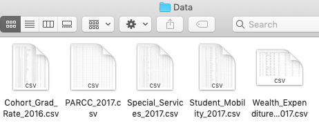
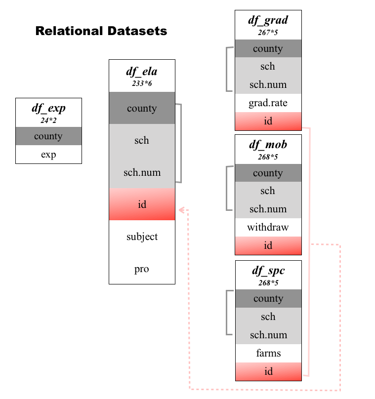

```{r setup, include=FALSE}
knitr::opts_chunk$set(echo = TRUE, message = FALSE,
                      warning = FALSE)
```

```{r,warning = F}
library(kableExtra)
library(tidyverse)
library(dplyr)
```


# Motivation

[LRJ: Once we finalize the case study, we should come back and revisit the intro/motivation section]

There are over 1400 public schools in Maryland and there are also outstanding students in each school. The federal Every Student Succeeds Act (ESSA) prompted states to develop long term plans to improve schools through accountability and innovation, which sets Maryland's schools on the path to continuous improvement. [Maryland Report Card website](http://reportcard.msde.maryland.gov/) aims to share the most current information available to help stakeholders understand and measure student achievement in all 24 local school systems. Here is a message from the State Superintendent of Schools that enables you to know more about how it functions.


<div align="center">
<iframe width="560" height="315" src="https://www.youtube.com/embed/g5ylQgdisTM" frameborder="0" allow="accelerometer; autoplay; encrypted-media; gyroscope; picture-in-picture" allowfullscreen>
</iframe>
</div>

<center>
[source: https://www.youtube.com/watch?time_continue=8&v=g5ylQgdisTM]
</center>

Our analysis is inspired by this plan - figure out how well schools were performing and how different factors influenced their performance. Once we indentify schools that need improvements and influential factors, both Maryland's government and local organizations can prompt actions and provide necessary support, in a way that is understanable and reliable.

The libraries used in this study are listed in the following table, 
along with their purpose in this particular case study:

|Library|Purpose|
|---|-------------------------------------------------------------------------------------------|
|`kableExtra`|Helps with building common complex tables and manipulating table styles; creates awesome HTML tables|
|`tidyverse`|A coherent system of packages for data manipulation, exploration and visualization |
|`dplyr`| Helps you solve the most common data manipulation challenges|


In order to run this code please ensure you have these packages installed. 

The learning objectives for this case study include:

  * data cleaning and wrangling
  * nested data structure

# What is the data?


The data files were downloaded from [the Maryland Report Card website](http://reportcard.msde.maryland.gov/).  Data files can be found by clicking [`Data Download`](http://reportcard.msde.maryland.gov/Graphs/#/DataDownloads/datadownload/3/17/6/99/XXXX) at the bottom of the web page.

At this link, you can find data for all 1400+ schools in Maryland from 2003 to 2018.  For this case study, we will focus on data from 2017.  In particular, we will extract data from 5 of the files for that year:

* [LRJ: List the names of the 5 files here and give a brief description of what type of data is in each file.]

# Data Import

After downloading the 5 data files, we can write a script to import all the files in the same folder into `R` relatively easily.  In this case, we've saved all files in a folder named `data2017`:



Knowing which environment you are in is necessary since it enables `R` to find these files quickly and accurately. Since our data files are in the folder `data2017`, we will need to specify this in the path to each file.

Also, instead of importing each file with an individual line of code, we can use the function `lapply()` to import them all simultaneously.  To do this, first we make a list of all of the files names for importing.  The `list.files()` function will make a list of all files in a folder that match a given pattern.  Here we want all `.csv` files, so we can use `pattern="*.csv"` to specify all files that end with a `.csv`.  The `*` character means any set of characters can be in that location in the file name.

```{r}
files = list.files(path='./data2017',pattern="*.csv")
files
```

Next we can add the folder name, `data2017`, to the path for each file:

```{r}
filePaths = paste0("./data2017/", files)
filePaths
```

Finally, we can read in each data file using `lapply()`:

```{r}
data <- lapply(filePaths, function(x){
  read.csv(x, header=T)})
```


`list.files(pattern="*.csv")` tries to find all the files whose names ending with 'csv', and stores the file location information into `files`. Function `lapply()` reads the files one by one and saves in list `data`.

# Data Wrangling

> Tidy datasets are all alike, but every messy dataset is messy in its own way. - Hadley Wickham

This section includes large amount of data wrangling such as gather, merge, mutate etc. Each step requires a specific tool to complete, and we would like to show the dataset again and again everytime we apply a specific tool. RStudio prodives a data viewer that enables you to look inside data frames and other rectangular data structures. You can invoke the viewer in a console by calling the `View()` function on the data frame you want to look at.

## Graduation Rate

The first file (Cohort_Grad_Rate_2017.csv) records the percentage of students who received a Maryland high school diploma during 2017. Before we extract this variable, let's have a qucik look of graduation rate file:

```{r eval = FALSE}
View(data[[1]])
```


There are totally `r ncol(data[[1]])` variables and `r nrow(data[[1]])` observations in it. From above, in the original dataset, there are several problems need to be fixed, such as missing value. We will deal with them one by one in later steps.

### Feature Selection and Rename 

The first step is to get school level data. We notice that if `School.Number` equals to 'A', then this row corresponds to county level data. Also, there are two kinds of graduation rate:

 * 4-year adjusted cohort: a school's cohort of first-time 9th grade students who graduate within four years, adjusted for students who transfer in and out of the cohort after 9th grade.
 * 3-year adjusted cohort: a school's cohort of first-time 9th grade students who graduate within three years, adjusted for students who transfer in and out of the cohort after 9th grade.
4-year adjusted cohort is kept since it is more representative. The last step is the selection of necessary variables. 

Function `filter()` and `select()` in [package `dplyr`](https://dplyr.tidyverse.org) will help us to finish the first wrangling step.  

```{r}
df_grad <- data[[1]] %>%
 filter( School.Number != 'A', 
        Cohort == '4-year adjusted cohort') %>%
 select(LEA.Name, School.Number,
         School.Name, Grad.Rate)

colnames(df_grad) <- c('county', 'sch.num',
                       'sch', 'grad.rate')
```


See what we get! Only school level information and useful variables are kept, leaving us a neater dataset. Next, missing values should be fixed.

### Missing Value

There are a lot of missing values in the dataset, which would influence further analysis if we leave them there. From the first plot, missing values exist in different forms:

* `'>= 95.00','<= 5.00'` : The graduation rate is higher than 95% or lower than 5%.
* `'*'` : This schools' graduation rate is simply not present in the data.

Use function `summary()` to produce the descriptive statistics of these missing values.

```{r}
summary(df_grad[2:4]) 
```

Pay attention to the first kind of missing value. It is impossible to calculate the exact graduate rate because of the lack of information, so we decide to use [`gsub()` function](https://www.rdocumentation.org/packages/base/versions/3.6.1/topics/grep) to replace incomplete values. `gsub()` function replaces all matches of a string. Elements of string vectors which are not substituted will be returned unchanged.

2.5 and 97.5 are used to replace '<= 5.00' and '>= 95.00' respectively.

```{r}
df_grad$grad.rate<- gsub('<= 5.00','2.5', df_grad$grad.rate)
df_grad$grad.rate <- gsub('>= 95.00','97.5', df_grad$grad.rate)
```


The second type of missing value ('*') is confusing, let's extract them out and have a look:

```{r}
head(df_grad[df_grad$grad.rate == '*', ])
```

If we search [Marley Glen School](https://www.aacps.org/domain/1364), we may found it mainly provides program for students with disabilities. Also, [Ruth Parker Eason School](https://www.aacps.org/Page/3684) provides a special education program for students with moderate to severe disabilities. So we guess schools with '*' graduation rate mainly provide education for students with moderate to severe disabilities. We can either delete it or replace them as 'NA'. Considering we need to merge multiple files in later steps, such kind of information may be dropped out automatically. Ths most appropriate method for us is replacing them as 'NA' and deal with them all together.

```{r}
df_grad$grad.rate <- na_if(df_grad$grad.rate, '*')
```


### Unique id

Our last step is to extract information from several files and merge them together, requiring a key that specifies each observation uniquely. Possible choices in present dataset can be `sch.num` or `sch.name` but we need to check whether each of them appear once in the dataset. If not, they are not suitable choice because of the lack of uniqueness.

```{r}
summary(df_grad[,2:3])
```

From the summary, whether `sch.num` or `sch.name`, the frequency of some values is larger than 1. Therefore it is definitely important to define a unique element by ourselves. 

```{r}
df_grad <- df_grad %>%
    within( id <- paste(county, sch, sep = '-'))
```

The combination of `county` and `sch` generates a new variable - `id`. To check its uniqueness, we use function `table()`, which builds a contingency table of the counts at each combination of factor levels. The `as.data.frame()` function converts the array-based representation of a contingency table to a data frame containing two variable: each factor `Var1`and its frequency `Freq`.

```{r}
tab <- as.data.frame(table(df_grad$id))
tab[tab$Freq > 1,]
```

Up to now, a unique key element `id` is generated and we finally create the ideal dataset - a tidy dataset.


## PARCC

[Partnership for Assessment of Readiness for College and Careers (PARCC)](https://parcc.pearson.com) reflects schools' academic achievements through assessing the performance of students on state standardized tests, such as English and Math. It not only provides information about students mastery of state standards, but also offers teachers and parents with timely information to inform instruction and how to provide support. From this file, we want to extract the percentage of students scoring 'high performance', which works as the target variable is data analysis part.

```{r}
colnames(data[[2]])
```

PARCC is a large file with `r nrow(data[[2]] )` observations and `r ncol(data[[2]] )` variables. We notice there are five levels of performance indicators, ranging from Level 1 to Level 5. First, we use percentage information rather than count information. Second, we will create a new variable, `pro`, that indicates the percentage of students performing at the 'met expectations' and 'exceeded expectations' levels.

### Feature Selection and Rename 

Similiar to graduation rate file, only school level information and necessary variables will be kept and renamed.

```{r}
df_parcc <- data[[2]] %>%
  filter( School.Number != 'A' ) %>%
  select(3,4,5,6,9,11,13,15,17)

colnames(df_parcc) <- c('county','sch.num', 
                        'sch', 'subject','L1',
                        'L2','L3','L4','L5')

```


Different with graduation rate file that just contains high school information, PARCC file also includes information of middle schools and elementary school. We would leave them there ????? 

Variable `subject` reflects the kind of subject test. English/Language Arts Grade 10, Algebra 1 and 2 are filtered out by function `filter()` in package `dplyr`. You are encouraged to keep other assessments that you are interested in.

```{r}
df_parcc <- df_parcc %>%
  filter(subject %in% c('English/Language Arts Grade 10','Algebra 1','Algebra 2'))
```


### Missing Value

Missing value is the toughest problem in this wrangling part. Let's see its summary first.

```{r}
summary(df_parcc[, 5:9])
```

There is only one kind of missing value: <=5.0 in these 5 levels indicators. We will replace it as NA, then transform them to numerical data.
 
```{r}
df_parcc[,5:9] <- 
  lapply(df_parcc[,5:9], function(x) as.numeric(as.character(x)))
```


We only care about the proportion of L4 and L5 but NAs are distributed differently. To simply wrangling steps, we reduce these five levels into two new levels : 'Level weak' (L1, L2 and L3) and 'Level excellent' (L4 and L5). Then deal with NAs in three ways. If values of 'Level excellent' are complete, then `pro` equals to sum of L4 and L5. Such as Algebra 1 assessment of 'Washington Middle', its `pro` should be $85.5 + 9.7 = 95.2$; If values of 'Level weak' all exist, `pro` equals to 100 percent minus the sum of L1, L2 and L3. For example, the `pro` of Algebra 1 for 'Fort Hill High' equals to $100-23.9-44.6-21.7 = 9.8$; 

```{r}
df_parcc$pro <- NA

indx1 <- !is.na(df_parcc$L4) &  !is.na(df_parcc$L5)
df_parcc[indx1, 'pro'] <- rowSums(df_parcc[indx1,8:9])

sum(is.na(df_parcc$pro))

indx2 <- !is.na(df_parcc$L1) &  !is.na(df_parcc$L2) & !is.na(df_parcc$L3)

df_parcc[indx2, 'pro'] <-  100-rowSums(df_parcc[indx2,5:7])

sum(is.na(df_parcc$pro)) 
```

Function `is.na()` indicates which elements are missing and returns a boolean index of the same shape as the original data frame. `df_parcc[indx1,]` and `df_parcc[indx2,]` specify observations have complete information of 'Level excellent' and 'Level weak' respectively. `sum(is.na(df_parcc$pro))` shows the counts of NA in variable `pro`. Undoubtedly, our methods reduce NAs greatly after we apply corresponding methods mentioned above. 

If missing values exist both in these two levels, we will first use 100 percent minus existing values. Then divide the difference to the number of missing value and replace NA with this quotient. For instance - 'Brooklyn Park Middle', there are three NAs, so $NA = (100-20.8-72.7)/3=2.2$, and `pro` equals to $72.7+2.2=74.9$. The reason we don't replace these NAs as 2.5 directly is that there is a restriction we don't want to obey - the sum of 5 levels equals to 100 percent. It is more reasonable to assume missing values are uniformly distributed than replace them with a fixed value directly.

```{r}
indx3 <- is.na(df_parcc$pro)


na_sum <- 100-rowSums(df_parcc[indx3, 5:9], na.rm = TRUE)
n <- rowSums(is.na(df_parcc[indx3, 5:9]))
na <- round(na_sum/n,1)

for (i in 1:length(indx3)){
  df_parcc[indx3, 5:9][i,which(is.na(df_parcc[indx3, 5:9][i,]))] <- na[i]
}

df_parcc[indx3, 'pro'] <- rowSums(df_parcc[indx3,8:9])
sum(is.na(df_parcc$pro)) 
```

What the above script does? First, rows containing NA in `pro` are filtered out and recorded as `indx3`, totally `r length(indx3)` observations. Then, for each row, we calculate the difference of 100 percent and sum of existing values - `na_sum`, and the number of missing value - `n`. Dividing `na_sum` by `n` gives the quotients `na`. All of these three variables are vectors which length are the same as `indx3` - `r length(na)`. The last step is replacement and we write a for loop here. For each row (`df_parcc[indx3, 5:9][i,]`), columns containing NA are selected out with the help of function `is.na()`. Applying function `which()` enables us to get the corresponding columns indexs. Once we determine the positions of NA, we can assign what we calculated before - `na` to these NAs.

Now, we have `r sum(is.na(df_parcc$pro))` NAs, which proves the validity and feasibility of our methods. The following step is to create a unique id - still use the combination of county name and school name. And we only keep new variable `pro` in the final dataset

```{r}
pac <- df_parcc %>%
  within( id <- paste(county, sch, sep = '-')) %>%
  select(1,2,3,4,10,11)
```

This is how the final parcc dataset looks like:


### Extract Assessment Information

The proportion of high performance in these assessment ($p$) plays an role of response variable in our later analysis. Thus, splicting them out first makes further analysis convenient.

$$ p_{ela} = \beta_0+\beta_{1} x_1+ \beta_{2} x_2 $$

```{r}
df_ela <- pac[grep("English/Language Arts Grade 10", pac$subject), ]
df_alg1 <- pac[grep("Algebra 1", pac$subject), ]
df_alg2 <- pac[grep("Algebra 2", pac$subject), ]
```

## Special Services

Special_Services_2017.csv records the number and percentage of students who applied different special service and students approved through direct certification. Such variables make us know more about the school quality and students support. Here we choose service FARMS: receive free or reduced price meals. 

What the following script does is similiar to previous wrangling steps except one step. Since in special service file there is a vairable called `School.Type`, we can filter high school information easily if we add a new condition `School.Type == 'High'`.

```{r}
df_spc <- data[[3]] %>%
  filter( School.Number != 'A', School.Type == 'High' ) %>%
  within( id <- paste(LEA.Name, School.Name, sep = '-')) %>%
  select(3,4,5,9,21) 

colnames(df_spc) <- c('county', 'sch.num', 'sch', 'farms', 'id')

summary(df_spc)
```


There is only one problem in this dataset, also it is an old problem - missing value.

### Missing Value

Similiarly, let's have a look on what these schools with '*' in farms look like:

```{r}
df_spc[df_spc$farms == '*',]
```

It seems that they are still not 'normal' public schools so we change '*' to NA. 

After replacing '<= 5.0' to '2.5' with function `gsub()`, if you apply `as.numeric()` function,  '*' will be transformed to NA automatically.

```{r}
df_spc$farms <- gsub('<= 5.0','2.5', df_spc$farms)
df_spc$farms <- as.numeric(df_spc$farms)
```

This is how the final special serivce dataset looks like:


## Student Mobility

Student_Mobility_2017.csv includes information of the movement of students from one school to another during the school year. There are 3 types of mobility provided: total student mobility, entry mobility, and exit mobility. To some extent, exit mobility reflects students' satisfaction with their schools so we would like to use it as variable `withdraw` in our analysis.

As usual, wrangling steps are high school observation selection, unique id creation, feature selection and missing value transformation.

```{r}
df_mob <- data[[4]] %>%
  filter( School.Number != 'A', School.Type == 'High' )%>%
  within( id <- paste(LEA.Name, School.Name, sep = '-')) %>%
  select(3,4,5,11,15)

colnames(df_mob) <- c('county', 'sch.num', 'sch', 'withdraw', 'id')

summary(df_mob)
```


```{r}
df_mob$withdraw <- gsub('<= 5.00','2.5', df_mob$withdraw)
df_mob$withdraw <- gsub('>= 95.00','97.5', df_mob$withdraw)
df_mob$withdraw <- as.numeric(df_mob$withdraw)
```
This is how the final mobility dataset looks like:


## Wealth Expenditures

Wealth_Expenditures_Data_2017.csv contains information of different kinds of investments as well as wealth per pupil. What makes it special is that its size (`r ncol(data[[5]])` variables and `r nrow(data[[5]])` observations) is obsivously smaller than previous files. Let's have a look on it:


It turns out that this file only contains county level data! So we would like to keep variable `county` which will work as the key in later merge steps. Besides, a new variable `exp` will be created by the formula:

$$exp = \frac{Wealth.Per.Pupil}{Expenditures.Per.Pupil}$$

The quotient of Wealth.Per.Pupil and Expenditures.Per.Pupil captures the image of each county's financial condition. Function `mutate()` in package `dplyr` is a nice tool to adds new variables. Thus, wrangling steps are new variable creation, feature selection and rename.

```{r}
df_exp <- data[[5]] %>%
  mutate(exp = round(Wealth.Per.Pupil/Expenditures.Per.Pupil, 1)) %>%
  select(3,12)

colnames(df_exp) <- c('county','exp')
```


We notice the last row is information about 'All Public School', but it will be dropped automatically when we merge it.

## Final Dataset

### Relational Datasets

Now we have totally 8 datasets:

| Dataset  |   Size   |
|----------|---------------|
| df_grad |`r nrow(df_grad)`*`r ncol(df_grad)`| 
| df_mob |`r nrow(df_mob)`*`r ncol(df_mob)`| 
| df_spc |`r nrow(df_spc)`*`r ncol(df_spc)`| 
| df_exp |`r nrow(df_exp)`*`r ncol(df_exp)`| 
| df_ela |`r nrow(df_ela)`*`r ncol(df_ela)`| 
| df_alg1 |`r nrow(df_alg1)`*`r ncol(df_alg1)`|
| df_alg2 |`r nrow(df_alg2)`*`r ncol(df_alg2)`|

We have many datasets, requiring combination to answer the questions that we are interested in. They are called *relational data* because it is their relations, not just the individual datasets, that are important. Relations are defined between a pair in these datasets. In out case, relations presented in the form that the same variable exists in multiple datasets. The following plot describes how our datasets connect:

 

We can see that variable `county` exists in all datasets, variable `sch`, `sch.name` and `id` exists in all datasets except `df_exp`. In addition, each dataset contain its unique variables. 

To work with relational data, *mutating joins* is pretty powerful which combines variables from two datasets. It first matches observations by their *keys*, then copies across variables from one dataset to the other. *keys* is a variable that uniquely indentifies an observation so it can connect each pair of datasets. This is the meaning of the existence of variable `id` - sufficiently indentifies each observation in our datasets. 

*mutating joins* includes *inner joins* and *outer joins*. An *inner join* keeps observations that appear in both datasets while *outer join* keeps observations that appear in at least one of the datasets. There are three types of *outer joins*: left join, right join and full join. The graphical explanation is given below:

Inner join:

{width=400px}

Outer join:
 
 {width=400px}


 
To be more specific, a table is provided to show detailed descriptions.

| Types | How it works | Implementation in `dplyr` |
|-------|-----------------------------------------------------|---------|
|inner join | keeps observations that appear in both datasets| `inner_join()`|
|left join| keeps all observations in `x` but drops bbservations in `y` but not in `x`| `left_join()`|
|right join| keeps all observations in `y` but drops bbservations in `x` but not in `y`|`right_join()`|
|full join| keeps all observations in `x` and `y`| `full_join()`|

Left join is the most common and popular method, especially when we only need part of variables from another dataset. It preserves the original observations even when there isn't a match - just make it as NA. This is also our best choice and we will show how it works in our case.


### Example

The final dataset should include predict variables `grad.rate`, `withdraw`, `farms`, `exp` and target variable `pro`. Three datasets with this structure will be created for `df_ela`, `df_alg1` and `df_alg2` respectively. As mentioned, we would focus on left join with the help of function `left_join()`. Let's see an example for `df_ela` first:

```{r}
temp <- df_ela %>%
  select(6,1,5) %>%
  left_join(df_grad[, c('grad.rate', 'id')], by = 'id') 

head(temp)
```

Look! `grad.rate` in `df_grad` was added to `df_ela` successfully. Option `by=` enables you to specify the *keys* you would like to use. Then, we repeat this step for `df_mob`, `df_spc` and `df_exp`.

| Dataset  |  Variable Kept     | Keys |
|--------|---------------------------------------------------------------------|------|
| df_grad|`grad.rate`: 4-year graduation rate| `id` |
| df_mob |`withdraw`: students' exit mobility| `id` |
| df_spc |`farms`: percentage of students reciving free/reduced price meals | `id` |
| df_exp |`exp`: quotient of wealth and expenditures | `county` |

```{r}
temp1 <- df_ela %>%
  select(6,1,5) %>%
  left_join(df_grad[, c('grad.rate', 'id')], by = 'id') %>%
  left_join( df_mob[, c('withdraw', 'id')], by = 'id') %>%
  left_join( df_spc[, c('farms', 'id')], by = 'id') %>%
  left_join(df_exp, by = 'county')
```

Instead of repeating by ourselves, the R base package provides a function `Reduce()`, which can come in handy. `Reduce()` takes a function $f$ of two arguments and a list or vector $x$ which is to be reduced using $f$. The function is first called on the first two components of $x$, then with the result of that as the first argument and the third component of $x$ as the second argument, then again with the result of the second step as first argument and the fourth component of $x$ as the second argument etc. The process is continued until all elements of $x$ have been processed.  

```{r}
L_ela <- list(df_ela[, c('id', 'county', 'pro')], 
              df_grad[, c('id','grad.rate')], 
              df_mob[, c('id','withdraw')], 
              df_spc[, c('id','farms')], df_exp)

temp2 <- Reduce(function(x,y) left_join(x, y, 
                                        by = colnames(y)[1]), L_ela)
# `by = colnames(y)[1])` tells how to find the *keys* in each left_join. 
```

The above script shows how `Reduce()` function works in out case. First, these five files are save in list `L_ela`. Then function `left_join()` was applied one by one in list `L_ela` with function `Reduce()`. `temp2` is the same dataset as `temp1`. So, let's write it as a function and apply it to `df_alg1` and `df_alg2`.

### Apply Function

```{r}
func_merge <- function(data){
L <- list(data[, c('id', 'county', 'pro')], 
              df_grad[, c('id','grad.rate')], 
              df_mob[, c('id','withdraw')], 
              df_spc[, c('id','farms')], df_exp)
  
  final_data<- Reduce(function(x,y) left_join(x, y, 
                                        by = colnames(y)[1]), L)
  return(final_data)
}

df_ELA <- func_merge(df_ela)
df_ALG1 <- func_merge(df_alg1)
df_ALG2 <- func_merge(df_alg2)
```

Wonderful! Finally we get the ideal datasets: `df_ELA`, `df_ALG1` and `df_ALG2`. However, the size of `df_ALG1` is greatly larger than the other two. Let's have a look on it:


Do you remember we didn't drop the middle school information before? Here comes the result - since `left_join()` preserves the original observations even when there isn't a match. All observations in `df_alg1` are kept, but we don't have data of `grad.rate`, `withdraw` and `farms` since we have selected high school information in their wrangling section. Therefore NAs are generated by function `left_join()` for these middle schools. Besides, `pro` of middle schools are much higher than that of high schools. It is because students who take Algebra1 test in middle schoos are more likely to be good at this subject. This fact makes them incompariable with students who take Algebra 1 test in high schools. If we delete middle school information, variable `pro` is pretty lower for the left high schools, so it fails to reflect this schools' academic achievements in Algebra 1. For `df_ELA` and `df_ALG2`, such problem doesn't exist so we would like to work on these two datasets.

# Exploratory data analysis


# Data analysis


